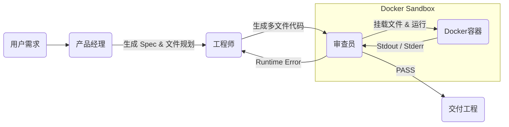

# 🤖 Meta-Dev-Team: 基于 LangGraph 的多智能体自主开发平台

> **Autonomous Multi-Agent Coding Workflow powered by LangGraph, Docker & DeepSeek**


## 📖 项目简介 (Introduction)

**Meta-Dev-Team** 是一个模拟真实软件开发流程的 **Agentic Workflow（智能体工作流）** 系统。

它不仅仅是一个代码生成器，而是一个具备 **自我修正能力的虚拟开发团队**。项目利用 **LangGraph** 编排了产品经理 (PM)、工程师 (Coder) 和 测试审查员 (Reviewer) 三个智能体，并引入了 **Docker 容器技术** 作为代码执行的“安全沙箱”。

核心突破在于实现了 **Runtime Self-Correction（运行时自我修复）**：系统会在隔离的 Docker 环境中真实运行生成的代码，捕获依赖缺失或逻辑错误，并自动反馈给工程师进行修正，直至项目在沙箱中成功运行。

## 🚀 核心亮点 (Key Features)

*   **🛡️ Docker 安全沙箱 (Secure Docker Sandbox)**: 
    *   摒弃危险的本地执行，所有代码均在临时 Docker 容器中编译运行。
    *   支持自动解析 `requirements.txt` 并隔离安装第三方依赖 (pip)，互不污染宿主机环境。
*   **📦 多文件工程支持 (Multi-File Project)**:
    *   支持生成复杂的工程结构（如 `main.py`, `utils.py`, `config.json` 等）。
    *   智能体具备文件系统感知能力，能处理模块间的引用关系。
*   **🔄 循环状态图 (Cyclic State Graph)**: 
    *   基于 LangGraph 构建具备“记忆”和“回环”能力的图结构，支持复杂的 Debug 循环迭代。
*   **🛠️ 运行时自我修复 (Runtime Self-Healing)**: 
    *   Reviewer 智能体能捕获 Traceback 报错，驱动 Coder 进行基于真实反馈的 Debug，而非仅靠静态文本检查。
*   **🎨 Anthropic 风格 UI**: 
    *   深度定制 Chainlit 界面，提供类似 Claude.ai 的优雅交互体验（字体优化、代码高亮、极简配色）。

## 🏗️ 架构设计 (Architecture)

系统采用 **Loop-based Multi-Agent** 架构，配合 **Ephemeral Container**（临时容器）策略：



1.  **PM Node**: 分析用户 Prompt，规划项目文件结构（File Structure）。
2.  **Coder Node**: 根据规划生成具体的文件内容字典。
3.  **Reviewer Node**: 
    *   启动临时 Docker 容器。
    *   将生成的代码文件挂载至容器。
    *   执行 `pip install` 和 `python main.py`。
    *   **Fail**: 捕获异常，路由回 Coder。
    *   **Pass**: 结束工作流，展示最终代码。

## 🛠️ 快速开始 (Quick Start)

### 1. 环境准备

需要安装 Python 3.10+ 以及 **Docker Desktop** (或 Docker Engine)。

```bash
# 克隆项目
git clone https://github.com/your-username/meta-dev-team.git
cd meta-dev-team

# 安装依赖 (推荐使用 uv 或 pip)
pip install -e .
```

### 2. 配置环境变量

复制 `.env` 文件并填入 LLM 配置（支持 DeepSeek, Qwen 等兼容 OpenAI 格式的模型）：

```ini
# .env
OPENAI_API_KEY=sk-xxxxxxxxxxxxxxxxxxxxxxxx
OPENAI_API_BASE=https://api.deepseek.com
MODEL_NAME=deepseek-coder
```

### 3. 运行系统

确保 Docker 正在运行，然后启动 Web 界面：

```bash
chainlit run src/meta_dev_team/app.py -w
```

浏览器访问 `http://localhost:8000` 即可开始交互。

## 📸 运行演示 (Demo)

**场景：用户要求 "爬取百度首页并保存为 CSV，需管理依赖"**

1.  **PM**：规划 `main.py` (逻辑), `requirements.txt` (依赖)。
2.  **Coder**：生成代码，包含 `requests` 和 `pandas`。
3.  **Reviewer**：
    *   启动 Docker。
    *   检测到 `requirements.txt`，自动执行 pip install。
    *   运行脚本。
4.  **Result**：Docker 运行通过，UI 展示所有生成的文件。

## 📦 技术栈 (Tech Stack)

*   **Core**: [LangGraph](https://github.com/langchain-ai/langgraph), [LangChain](https://github.com/langchain-ai/langchain)
*   **Infrastructure**: [Docker SDK for Python](https://docker-py.readthedocs.io/)
*   **Model**: DeepSeek-V3 / Qwen-2.5-Coder
*   **Frontend**: [Chainlit](https://github.com/Chainlit/chainlit) (Customized CSS)
*   **Package Manager**: uv

## 🔮 未来规划 (Roadmap)

*   [x] **多文件项目支持**: 支持生成和管理复杂工程结构。
*   [x] **Docker 沙箱**: 实现环境隔离与依赖自动安装。
*   [ ] **联网搜索能力**: 为 PM 增加 Search Tool，支持查阅最新 API 文档。
*   [ ] **数据可视化**: 支持 Agent 生成图表并在 UI 直接渲染。
*   [ ] **Human-in-the-loop**: 允许用户在 Review 阶段介入修改代码。

## 📄 License

MIT License
```