# 🤖 Meta-Dev-Team: 基于 LangGraph 的多智能体自主开发平台

> **Autonomous Multi-Agent Coding Workflow powered by LangGraph & DeepSeek**


## 📖 项目简介 (Introduction)

**Meta-Dev-Team** 是一个模拟真实软件开发流程的 **Agentic Workflow（智能体工作流）** 系统。

不同于传统的单次问答式 LLM，本项目利用 **LangGraph** 构建了一个包含 **产品经理 (PM)**、**工程师 (Coder)** 和 **测试审查员 (Reviewer)** 的多智能体协作闭环。

核心突破在于实现了 **Runtime Self-Correction（运行时自我修复）** 机制：系统不仅生成代码，还会通过沙箱真实执行代码，捕获运行时错误（Runtime Errors），并自动反馈给工程师进行修正，直至测试通过。

## 🚀 核心亮点 (Key Features)

*   **🔄 循环状态机 (Cyclic State Graph)**: 摒弃线性的 Chain 结构，采用 LangGraph 构建具备“记忆”和“回环”能力的图结构，支持多轮迭代。
*   **🛠️ 运行时自我修复 (Runtime Self-Healing)**: 集成 Python 解释器沙箱，Reviewer 智能体能捕获 Traceback 报错，驱动 Coder 进行基于真实反馈的 Debug，而非仅靠静态文本检查。
*   **🎭 角色扮演 (Role Playing)**:
    *   **PM**: 将模糊需求转化为结构化的 Spec 文档。
    *   **Coder**: 遵循 Spec 编写可执行脚本。
    *   **Reviewer**: 执行代码审查与运行测试，决定流程是“PASS”还是“打回重写”。
*   **💬 可视化交互界面**: 集成 **Chainlit**，实时展示多智能体思考、行动和交互的全过程。

## 🏗️ 架构设计 (Architecture)

系统采用典型的 **Loop-based Multi-Agent** 架构：

```mermaid
graph LR
    User(用户需求) --> PM(产品经理)
    PM --> Coder(工程师)
    Coder --> Reviewer(审查员/运行环境)
    Reviewer -- "运行报错/逻辑错误" --> Coder
    Reviewer -- "PASS" --> End(交付代码)
```



1.  **PM Node**: 分析用户 Prompt，生成 `Plan`。
2.  **Coder Node**: 根据 `Plan` 或 `Review Feedback` 生成/修改 `Code`。
3.  **Reviewer Node**: 使用 `PythonREPL` 执行代码。
    *   **Fail**: 捕获异常信息，更新 State，路由回 Coder。
    *   **Pass**: 结束工作流，输出最终代码。

## 🛠️ 快速开始 (Quick Start)

### 1. 环境准备

确保已安装 Python 3.10+。推荐使用 `uv` 或 `pip` 管理依赖。

```bash
# 克隆项目
git clone https://github.com/your-username/meta-dev-team.git
cd meta-dev-team

# 安装依赖 (使用 pip)
pip install -e .

# 或者使用 uv (推荐)
uv sync
```

### 2. 配置环境变量

在项目根目录复制 `.env` 文件并填入你的 API Key（推荐使用 DeepSeek 或 阿里云 Qwen）：

```ini
# .env
OPENAI_API_KEY=sk-xxxxxxxxxxxxxxxxxxxxxxxx
OPENAI_API_BASE=https://api.deepseek.com  # 或 https://dashscope.aliyuncs.com/compatible-mode/v1
MODEL_NAME=deepseek-coder                 # 或 qwen-2.5-coder-32b-instruct
```

### 3. 运行 Web 界面

本项目内置 Chainlit 界面，提供类似 ChatGPT 的交互体验。

```bash
chainlit run src/meta_dev_team/app.py -w
```

运行成功后，浏览器将自动打开 `http://localhost:8000`。

### 4. 命令行模式 (可选)

如果你更喜欢在终端查看日志：

```bash
python src/meta_dev_team/main.py
```

## 📸 运行演示 (Demo)

**场景：用户要求计算 "10 除以 0"**

1.  **Coder** 初次提交：写出了 `print(10/0)`。
2.  **Reviewer** 运行：捕获 `ZeroDivisionError`。
3.  **Graph** 路由：触发 Conditional Edge，退回 Coder。
4.  **Coder** 修复：修改为 `try-except` 结构。
5.  **Reviewer** 复测：运行通过，输出 PASS。

*(此处可后续补充 Chainlit 运行截图)*

## 📦 技术栈 (Tech Stack)

*   **Orchestration**: [LangGraph](https://github.com/langchain-ai/langgraph)
*   **LLM Framework**: [LangChain](https://github.com/langchain-ai/langchain)
*   **Model**: DeepSeek-V3 / Qwen-2.5-Coder
*   **UI**: [Chainlit](https://github.com/Chainlit/chainlit)
*   **Sandbox**: LangChain Experimental PythonREPL
*   **Package Manager**: uv / pip

## 🔮 未来规划 (Roadmap)

*   [ ] **多文件项目支持**: 让 Coder 能够生成和管理包含多个文件的复杂工程结构。
*   [ ] **Human-in-the-loop**: 在 Reviewer 报错时引入人工介入机制，允许用户手动指导修复方向。
*   [ ] **Docker 沙箱**: 将代码执行环境从本地 REPL 迁移至 Docker 容器，提升安全性。

## 📄 License

MIT License

---
